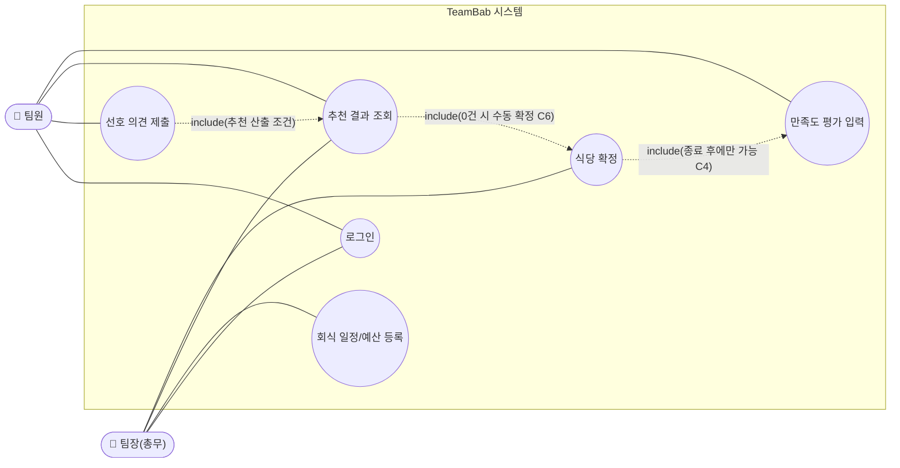

# TeamBab 도메인 정의서

| 버전 | 날짜/시간 | 변경 내용 |
|---|---|---|
| 1.5 | 2026-08-13 | 사용자 엔티티에 로그인id·비밀번호(해시) 추가 — F0(로그인) 구현에 필요한 자격증명 속성이 누락되어 있었음 |
| 1.4 | 2026-08-13 | docs 전체 정합성 재검토: 만족도 평가에 식당id(FK)를 명시해 `7-erd.md`/`8-schema.sql`의 실제 스키마와 일치시킴(기존에는 "간접, 회식일정 경유"로만 서술되어 있었음) |
| 1.3 | 2026-08-13 | PRD(`2-PRD.md`)와 정합성 검토: "추천 결과"를 비영속(응답 전용) 엔티티로 명시해 PRD 구현 결정과 일치시킴 |
| 1.2 | 2026-08-13 | 2차 검토 반영: F2 상태값 모순 수정("확정"→"종료"), F1 0건 예외 수용기준(C6) 추가, 확정식당 속성 명시, 추적표에 F0 추가 |
| 1.1 | 2026-08-13 | 검토 피드백 반영: 정량 기준, 추적성, 엔티티, 예외 흐름, 수용 기준 추가 |
| 1.0 | 2026-08-13 | 최초 작성 |

## 1. 개요

TeamBab은 B2B 영업/프로모션 업무(파트너사·거래처 대상 홍보·영업)를 수행하는 팀의 회식을 통해 팀원 만족도와 사기를 높이기 위한 회식 의사결정 지원 애플리케이션이다. 팀원의 선호 의견과 과거 만족도를 반영해 식당을 추천하고, 팀장(총무)이 최종 확정한다.

## 2. 문제 정의

- **P1**: 회식 결정이 소수 의견으로 정해져 팀원 만족도가 낮다.
- **P2**: 회식 후 만족도를 측정하고 다음 회식에 반영하는 절차가 없어, "팀원 만족도 제고"라는 목적이 실제 운영에 연결되지 않는다.

## 3. 핵심 기능

로그인은 전제 기능, 그 위에 핵심 기능 2가지만 정의한다. (그 외 기능은 확장 과제로 미룬다)

### F0. 로그인 (전제 기능)
모든 사용자는 인증 후에만 F1, F2의 기능을 이용할 수 있다.

### F1. 선호 의견 기반 추천 및 확정 — *(P1 해결)*
- 팀원은 먹고 싶은 메뉴/식당, 못 먹는 음식을 의견으로 제출한다.
- 시스템은 팀원 의견 + 예산 + 과거 만족도 점수를 반영해 식당을 추천한다.
- 팀장(총무)은 추천 목록 중 하나를 최종 확정한다. 팀원은 확정 권한이 없다.
- **예외**: 추천 후보가 0건이면(예산 조건을 만족하는 식당 없음) "조건에 맞는 추천 결과가 없습니다"를 표시하고 팀장이 수동으로 식당을 확정할 수 있다. *(수용 기준: C6)*

### F2. 만족도 평가 및 다음 추천 반영 (피드백 루프) — *(P2 해결)*
- 회식 종료 후 팀원은 만족도 평가(1~5점 별점 + 한줄평)를 입력한다.
- 만족도 점수는 자동으로 이력에 저장되고, 다음 추천 시 가중치로 반영된다.
- **예외**: 회식이 "종료" 상태가 아니면 만족도 평가를 입력할 수 없다. *(수용 기준: C4)*

> 회식 일정(날짜/예산/인원) 등록, 과거 이력 단순 조회는 F1·F2가 동작하기 위한 최소 부속 데이터로만 존재하며 별도 핵심 기능으로 다루지 않는다.

## 4. 사용자 역할

| 역할 | 권한 |
|---|---|
| 팀장(총무) | 회식 일정/예산 입력, 추천 결과 확인, 최종 식당 확정 |
| 팀원 | 선호 의견 제출, 추천 결과 조회, 회식 후 만족도 평가 입력 |

## 5. 핵심 엔티티

| 엔티티 | 주요 속성 | 관계 |
|---|---|---|
| 사용자 | id, 로그인id, 비밀번호(해시), 이름, 역할(팀장/팀원) | 1 사용자 - N 선호의견, N 만족도평가 |
| 회식 일정 | id, 날짜, 예산(1인당 금액), 인원, 상태(모집중/확정/종료), 확정식당id(FK, 확정 전 null) | 1 회식일정 - N 선호의견 |
| 선호 의견 | id, 회식일정id, 사용자id, 희망메뉴/식당, 못먹는음식 | N:1 회식일정, N:1 사용자 |
| 추천 결과 | 회식일정id, 식당후보 목록(식당명, 점수) — **비영속**: 별도 테이블에 저장하지 않고 추천 요청 시점에 계산해 응답으로만 반환 (`2-PRD.md` 6장) | N:1 회식일정 (논리적 관계, DB 관계 아님) |
| 만족도 평가 | id, 회식일정id, 사용자id, 식당id(회식 확정 시점의 확정식당id를 복사), 별점(1~5), 한줄평 | N:1 회식일정, N:1 사용자, N:1 식당 |
| 식당 | id, 이름, 최근 방문 이력, 누적 평균 만족도 점수 | 1 식당 - N 만족도평가(직접 FK, `7-erd.md`/`8-schema.sql` 참고 — 매번 회식일정을 조인하지 않도록 식당id를 직접 참조) |

만족도 점수는 **식당 단위 누적 평균**(해당 식당에서 진행된 모든 회식의 별점 평균)이며, F2에서 다음 추천 가중치로 쓰이는 값도 이 식당 단위 값이다.

## 6. 핵심 도메인 용어

- **선호 의견**: 팀원이 제출하는 먹고 싶은 메뉴/식당, 못 먹는 음식·알레르기 정보
- **추천 결과**: 예산, 선호 의견, 만족도 점수를 반영해 시스템이 제시하는 후보 식당 목록
- **확정**: 팀장이 추천 결과 중 하나를 최종 선택하는 행위
- **만족도 점수**: 식당 단위 누적 평균 별점(1~5점). 팀원 만족도 제고 목표의 핵심 지표이자 다음 추천의 가중치 요소

## 7. 제약 사항 (수용 기준)

| ID | 조건 (GIVEN/WHEN) | 기대 동작 (THEN) |
|---|---|---|
| C1 | 로그인하지 않은 사용자가 임의 기능 요청 시 | 인증 오류 반환, 로그인 화면으로 이동 |
| C2 | 팀원이 확정 API를 호출 시 | 권한 오류(403) 반환, 확정 불가 |
| C3 | 예산 정보 미입력 상태에서 추천 요청 시 | "예산을 먼저 입력하세요" 오류 반환, 추천 미실행 |
| C4 | 회식 상태가 "종료"가 아닌 상태에서 만족도 평가 입력 시 | 입력 거부, "회식 종료 후 평가 가능" 안내 |
| C5 | 특정 식당의 누적 평균 만족도 점수가 **2.5점(5점 만점) 미만**이거나, 최근 **3회** 이내 방문 이력이 있을 시 | 해당 식당은 추천 후보 우선순위 최하위로 배치(제외는 아님) |
| C6 | 예산 조건을 만족하는 추천 후보가 0건일 시 | "조건에 맞는 추천 결과가 없습니다" 표시, 팀장이 후보 목록 없이 수동으로 식당을 확정 가능 |

기준값(C5의 2.5점, 3회)은 하드코딩 상수가 아니라 팀장이 조정 가능한 설정값으로 둔다.

## 8. 요구사항 ↔ 기능 추적표

| 문제/전제 | 해결 기능 | 검증 기준 |
|---|---|---|
| (전제) | F0 | C1 |
| P1 (소수 의견 결정) | F1 | C2, C3, C6 |
| P2 (만족도 미반영) | F2 | C4, C5 |

## 9. 유스케이스 다이어그램

- F0(로그인) → UC0
- F1(선호 의견 기반 추천 및 확정) → UC1, UC2, UC3, UC4
- F2(만족도 평가 및 다음 추천 반영) → UC5 (결과는 다시 UC3의 추천 로직에 반영되는 피드백 루프)
