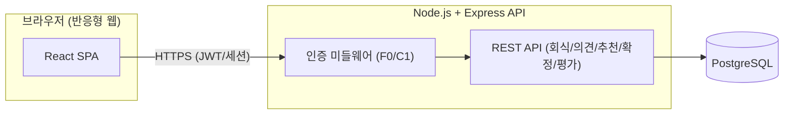

# TeamBab PRD (제품 요구사항 문서)

| 버전 | 날짜       | 변경 내용                           |
| ---- | ---------- | ----------------------------------- |
| 1.0  | 2026-08-13 | 최초 작성 (도메인 정의서 v1.2 기반) |

> 본 문서는 `prompts/teambab-domain.md` (TeamBab 도메인 정의서 v1.2)를 기반으로 작성되었다. 엔티티/용어/제약사항(C1~C6)/추적표는 도메인 정의서를 그대로 재사용하며, 본 문서는 이를 "5일/1인 개발" 제약 하에서 실행 가능한 제품 요구사항으로 구체화한다.

## 1. 개요/배경

TeamBab은 B2B 영업/프로모션 업무를 수행하는 팀의 회식을 통해 팀원 만족도와 사기를 높이기 위한 회식 의사결정 지원 웹 애플리케이션이다.

- **P1**: 회식 결정이 소수 의견으로 정해져 팀원 만족도가 낮다.
- **P2**: 회식 후 만족도를 측정해 다음 회식에 반영하는 절차가 없다.

이를 해결하기 위해 팀원의 선호 의견과 과거 만족도 점수를 반영한 추천 → 팀장 확정 → 만족도 평가 → 다음 추천 반영이라는 피드백 루프를 핵심 기능으로 삼는다. 상세 엔티티/용어/유스케이스 다이어그램은 도메인 정의서 3~9장을 따른다.

## 2. 목표 사용자 및 비즈니스 목표

- **목표 사용자**: 4~10명 규모의 팀 — IT 개발팀, 스타트업, 소프트웨어 하우스 등에서 회식을 정기적으로 진행하는 조직.
- **비즈니스 목표**: 3,000개 이상의 팀이 동시에 프로젝트(회식 사이클)를 진행할 수 있는 서비스로 성장 (본 PRD에서는 이를 최소 아키텍처 수준의 비기능요구사항으로만 다룸, 5장 참고).
- **경쟁사 참고**: 일정 변경 시 채팅 이력으로 근거를 남기는 경쟁 서비스가 있음 → 본 도메인(회식 확정)에 적용할지 여부는 8장(리스크 및 향후 과제)에서 판단.

## 3. 범위 (5일 일정 기준)

### In-Scope

- F0: 로그인 (전제 기능)
- F1: 선호 의견 기반 추천 및 확정
- F2: 만족도 평가 및 다음 추천 반영
- 위 기능이 동작하기 위한 최소 부속 데이터: 회식 일정(날짜/예산/인원) 등록, 과거 이력 단순 조회
- 반응형 웹 UI (모바일 브라우저에서 깨지지 않는 수준)

### Out-of-Scope (이번 5일 범위 제외)

- Google Calendar, Slack 등 외부 서비스 연동 (추후 과제)
- 일정 변경 시 채팅 이력 근거 기록 기능 (추후 검토, 8장 참고)
- 회식 일정 자체의 수정/취소 이력 관리, 알림/메일 발송
- 접근성(a11y) 대응
- 팀/조직 관리, 초대, 권한 세분화 등 관리자 기능 (역할은 팀장/팀원 2종 고정)
- 통계 대시보드, 관리자 콘솔 등 부가 기능
- 모바일 전용 앱 (반응형 웹으로만 대응)

## 4. 기능 요구사항

### F0. 로그인 (전제 기능)

**사용자 스토리**: 팀원 또는 팀장으로서, 나는 인증 후에만 서비스 기능을 이용하고 싶다. 그래야 회식 데이터가 팀 내부에서만 관리된다.

**수용 기준**

- C1: 로그인하지 않은 사용자가 F1/F2의 임의 기능을 요청하면 인증 오류를 반환하고 로그인 화면으로 이동시킨다.

### F1. 선호 의견 기반 추천 및 확정 — (P1 해결)

**사용자 스토리**

- 팀원으로서, 나는 먹고 싶은 메뉴/식당과 못 먹는 음식을 제출하고 싶다. 그래야 내 의견이 추천에 반영된다.
- 팀장(총무)으로서, 나는 팀원 의견·예산·과거 만족도를 반영한 추천 목록을 보고 그중 하나를 확정하고 싶다. 그래야 소수 의견이 아닌 근거 있는 결정을 내릴 수 있다.

**수용 기준**

- C2: 팀원이 확정 API를 호출하면 403 권한 오류를 반환하고 확정을 거부한다. (확정 권한은 팀장에게만 있음)
- C3: 예산 정보가 입력되지 않은 상태에서 추천을 요청하면 "예산을 먼저 입력하세요" 오류를 반환하고 추천을 실행하지 않는다.
- C6: 예산 조건을 만족하는 추천 후보가 0건이면 "조건에 맞는 추천 결과가 없습니다"를 표시하고, 팀장이 후보 목록 없이 수동으로 식당을 확정할 수 있다.
- C5(추천 로직에 반영): 특정 식당의 누적 평균 만족도 점수가 2.5점 미만이거나 최근 3회 이내 방문 이력이 있으면 추천 후보 우선순위 최하위로 배치한다(제외하지 않음). 기준값(2.5점, 3회)은 팀장이 조정 가능한 설정값으로 둔다.

### F2. 만족도 평가 및 다음 추천 반영 (피드백 루프) — (P2 해결)

**사용자 스토리**: 팀원으로서, 나는 회식 종료 후 만족도(별점 1~5 + 한줄평)를 남기고 싶다. 그래야 다음 회식 추천이 더 좋아진다.

**수용 기준**

- C4: 회식 상태가 "종료"가 아니면 만족도 평가 입력을 거부하고 "회식 종료 후 평가 가능"을 안내한다.
- 만족도 점수는 식당 단위 누적 평균으로 저장되며, F1의 다음 추천 시 가중치(C5 로직)로 반영된다.

### 요구사항 ↔ 기능 추적표 (도메인 정의서 8장 재사용)

| 문제/전제           | 해결 기능 | 검증 기준  |
| ------------------- | --------- | ---------- |
| (전제)              | F0        | C1         |
| P1 (소수 의견 결정) | F1        | C2, C3, C6 |
| P2 (만족도 미반영)  | F2        | C4, C5     |

## 5. 비기능 요구사항

- **기술 스택**: 프론트엔드 React 19, 백엔드 Node.js + Express, 데이터베이스 PostgreSQL 17(`pg` 라이브러리).
- **플랫폼**: 웹 우선, 반응형 UI로 모바일 브라우저 대응 (별도 모바일 앱 없음).
- **접근성**: 이번 범위에서 고려하지 않음.
- **연동**: Google Calendar, Slack 등 외부 서비스 연동 미적용 (추후 과제, 8장 참고).
- **확장성 (3,000개 팀 동시 사용 목표)**: 5일 개발 범위에서는 아래 최소 수준만 반영하고, 그 이상의 인프라 설계(캐시 계층, 샤딩, 큐 등)는 하지 않는다.
  - 백엔드 API는 상태 비저장(stateless)으로 구현해 수평 확장이 가능한 구조만 유지.
  - PostgreSQL 커넥션 풀 사용 (예: `pg` 라이브러리 기본 풀).
  - 별도 부하 테스트/오토스케일링 설정은 향후 과제로 미룸.
- **보안**: 로그인 세션/토큰 기반 인증(C1), 역할 기반 권한 검사(C2) 최소 수준만 구현.

## 6. 기술 아키텍처 개요

- 단일 Express 앱 + REST API, 별도 마이크로서비스/큐/캐시 도입 없음 (오버엔지니어링 금지 원칙).
- 추천 로직은 별도 배치/AI 서버 없이 API 요청 시점에 SQL 쿼리 + 애플리케이션 코드로 동기 계산 (예산 필터 → C5 가중치 정렬).
- 인증은 세션 또는 JWT 중 구현 난도가 낮은 방식 택1 (역할: 팀장/팀원 클레임 포함).
- 테이블은 도메인 정의서 5장의 엔티티(사용자, 회식 일정, 선호 의견, 추천 결과, 만족도 평가, 식당)를 그대로 스키마화. 추천 결과는 매 요청 시 재계산하는 값이므로 영속 테이블이 아닌 응답 전용 구조로 단순화 가능 (필요 시 감사 로그 목적으로만 저장, 이번 범위에서는 미저장 — 향후 검토).

## 7. 마일스톤/일정 (5일, 1인 개발)

| Day | 작업                                                                                       |
| --- | ------------------------------------------------------------------------------------------ |
| 1   | DB 스키마 설계·마이그레이션(사용자/회식일정/선호의견/만족도평가/식당), 인증(F0, C1) 구현   |
| 2   | 회식 일정/예산 등록 API·화면, 선호 의견 제출 API·화면                                      |
| 3   | 추천 로직 구현(예산 필터, C5 가중치, C6 0건 예외) 및 추천 결과 화면, 확정 API·화면(C2, C3) |
| 4   | 만족도 평가 입력 API·화면(C4), 식당 단위 누적 평균 갱신 로직, F1 추천에 반영 확인          |
| 5   | 통합 테스트(C1~C6 수용 기준 검증), 반응형 UI 점검, 버그 수정 및 배포                       |

## 8. 리스크 및 향후 과제

- **일정 변경 시 채팅 이력 근거 기록**: 경쟁사는 일정 변경 시 채팅 이력을 근거로 남기지만, TeamBab의 확정은 "팀장이 추천 목록 중 하나를 선택"하는 단순 행위이고 5일 범위 안에서 채팅/댓글 기능을 새로 만드는 것은 오버엔지니어링에 해당한다. → **향후 검토 과제**로만 남기고, 이번 범위에서는 확정 시 사유를 남기는 기능을 구현하지 않는다. (필요해지면 "확정 사유" 텍스트 필드 1개 추가 정도의 최소 대안부터 검토)
- **Google Calendar / Slack 연동**: 추후 적용 예정, 이번 범위 제외.
- **3,000개 팀 동시 사용**: 실제 부하 테스트/스케일링 설계는 하지 않음. 상태 비저장 API + 커넥션 풀 정도의 최소 구조만 갖추고, 실사용 트래픽이 늘어나는 시점에 재검토.
- **팀장 부재/교체 시나리오, 팀 관리 기능 부재**: 현재는 역할만 존재하고 팀 단위 소속 관리가 없음 → 다중 팀 운영 시나리오는 향후 과제.
- **일정 리스크**: 1인 개발 + 5일이라는 제약상 통합 테스트(Day 5)에 문제 발생 시 버퍼가 거의 없음. F1의 추천 로직(C5, C6)과 F2 피드백 반영이 이번 범위의 핵심 리스크 지점이므로 우선순위를 두고 구현.
