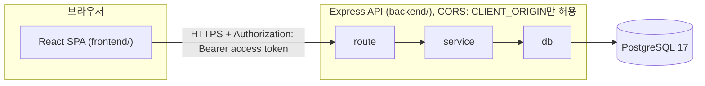
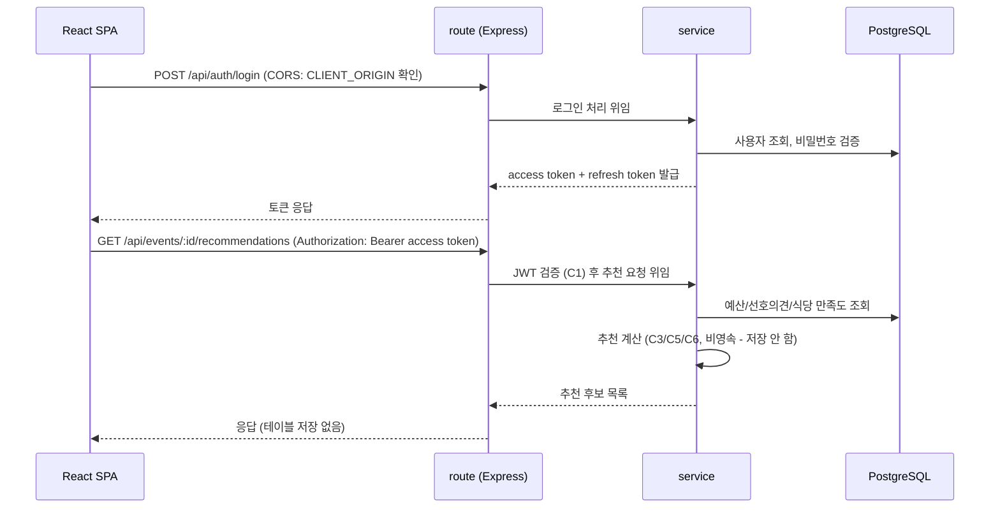

# TeamBab 기술 아키텍처 다이어그램

| 버전 | 날짜 | 변경 내용 |
|---|---|---|
| 1.0 | 2026-08-13 | 최초 작성 (도메인 정의서 v1.3, PRD v1.1, 프로젝트 구조 원칙 기반) |

> 5일/1인 개발 MVP 규모에 맞춰 최대한 단순하게 표현한다. 마이크로서비스, 캐시, 큐, 로드밸런서 등 이 프로젝트에 없는 요소나 Google Calendar/Slack 등 Out-of-Scope 연동은 넣지 않는다.

## 1. 전체 구조

- **React SPA(frontend/)**: 팀장/팀원이 사용하는 반응형 웹 화면. access/refresh token을 보관하고 API를 호출한다.
- **Express API(backend/)**: route(HTTP 처리) → service(도메인 로직, JWT 검증 포함) → db(SQL 실행) 3단 구조. CORS 미들웨어가 `CLIENT_ORIGIN`만 허용해 SPA 도메인 경계를 지킨다.
- **PostgreSQL**: 사용자/회식 일정/선호 의견/만족도 평가/식당 테이블만 존재. 추천 결과는 별도 테이블 없이 매 요청 시 계산해 응답으로만 반환한다.

## 2. 요청 흐름 (로그인 + 추천 조회 예시)

- 로그인은 access token(단기 만료) + refresh token(장기 만료, DB에 해시 저장)을 발급한다.
- 이후 모든 요청은 access token을 route에서 검증(C1)한 뒤 service로 넘긴다.
- 추천 결과는 service에서 매 요청 시 계산만 하고 DB에 저장하지 않는다(비영속).
