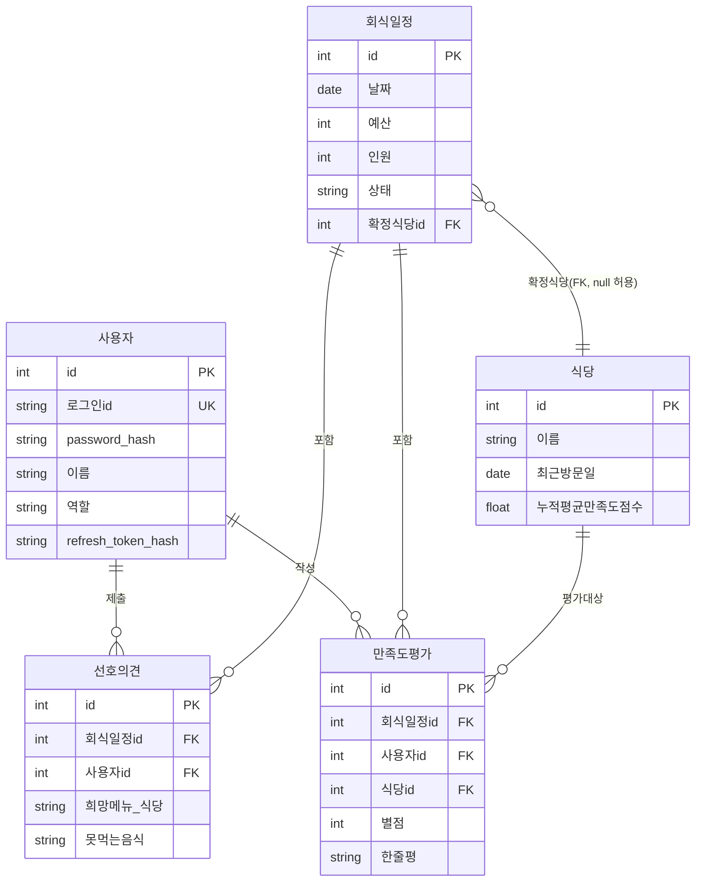

# TeamBab ERD

> 도메인 정의서(`1-domain-definition.md` 5장) v1.4, PRD(`2-PRD.md`) v1.2 기준.

## 매핑 및 설계 메모

- **사용자 / 회식일정 / 선호의견 / 식당**: 도메인 정의서 5장 엔티티를 그대로 반영. `사용자.refresh_token_hash`는 PRD 6장(JWT refresh token 저장 위치) 결정 반영.
- **만족도평가.식당id (FK)**: 도메인 정의서 v1.4(5장)에 직접 FK로 명시됐다. 회식일정이 확정식당을 가지므로 식당 조회는 간접(회식일정 경유)으로도 가능하지만, 식당 단위 누적 평균 계산(5장 각주, C5 가중치 계산)이 F1 추천 때마다 반복 조회되는 핵심 로직이라, 매번 회식일정을 조인하는 대신 만족도평가에 식당id를 직접 두어 조회를 단순화했다. 회식일정 확정 시점의 확정식당id를 그대로 복사해 넣는 정도로, 별도 정규화/동기화 로직은 만들지 않는다.
- **추천 결과는 엔티티로 넣지 않음**: 도메인 정의서 5장, PRD 6장에 따라 추천 결과는 비영속이며 추천 요청 시점에 SQL 쿼리 + 애플리케이션 코드로 계산해 응답으로만 반환한다. DB에 저장하지 않으므로 ERD에 테이블/관계로 표현하지 않는다.
- 설정 테이블(C5 임계값), 감사 로그 등은 PRD 6장에서 서버 상수로 처리하기로 했으므로 5일/1인 MVP 범위상 테이블을 만들지 않았다(오버엔지니어링 금지).
</content>
