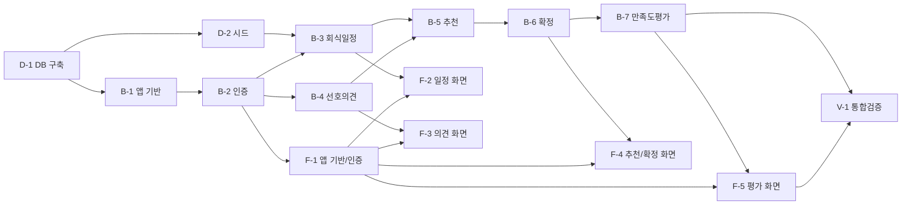

# TeamBab 실행 계획

| 버전 | 날짜 | 변경 내용 |
|---|---|---|
| 1.0 | 2026-08-13 | 최초 작성 (도메인 정의서 v1.4, PRD v1.2, 프로젝트 원칙 v1.2, ERD, 스키마 기반) |

> 5일/1인 개발 MVP 기준. 각 Task는 독립적으로 착수·완료 가능한 단위로 분해하고, 선행 Task와 체크박스 완료 조건을 명시한다. 범위는 `2-PRD.md` 3장 In-Scope(F0/F1/F2)로 한정한다.

## Task 의존 관계

---

## 1. 데이터베이스 (D)

### D-1. DB 생성 및 스키마 적용
- **선행 Task**: 없음
- **작업**
  - PostgreSQL 17 인스턴스 준비(로컬 또는 컨테이너), `teambab` 데이터베이스 생성
  - `backend/migrations/001_init.sql`에 `docs/8-schema.sql` 내용 배치 후 실행
  - `DATABASE_URL` 환경변수 정의 및 `.env.example` 등록
- **완료 조건**
  - [x] `users`, `restaurants`, `events`, `preferences`, `reviews` 5개 테이블이 생성됨
  - [x] `users`에 `login_id`(UNIQUE), `password_hash` 컬럼이 존재함(F0 로그인 전제)
  - [x] `restaurants.cost_per_person`이 존재함(예산 필터 C3/C6의 비교 기준)
  - [x] `events.status` CHECK 제약이 `모집중/확정/종료`만 허용함
  - [x] `users.role` CHECK 제약이 `팀장/팀원`만 허용함
  - [x] `reviews.rating` CHECK 제약이 1~5만 허용함
  - [x] `events.confirmed_restaurant_id`가 NULL 허용 FK로 동작함
  - [x] `reviews.restaurant_id`가 `restaurants(id)` FK로 동작함
  - [x] 추천 결과 테이블이 존재하지 않음(비영속 결정 준수)

### D-2. 시드 데이터 투입
- **선행 Task**: D-1
- **작업**
  - 팀장 1명 + 팀원 3~5명 계정(bcrypt 해시 비밀번호) INSERT
  - 식당 8~10개 INSERT(1인 예상 비용대·누적 평균 만족도·최근 방문일을 서로 다르게 구성)
  - C5 검증용 데이터 포함: 만족도 2.5점 미만 식당 1개 이상, 최근 3회 이내 방문 식당 1개 이상
- **완료 조건**
  - [x] 팀장/팀원 계정으로 각각 로그인 가능한 사용자 레코드가 존재함
  - [x] 식당 데이터가 8개 이상이며 만족도 점수 분포가 2.5점 위/아래로 나뉨
  - [x] C6(0건) 재현이 가능한 예산 구간이 존재함(모든 식당보다 낮은 예산 입력 시 후보 0건)

---

## 2. 백엔드 (B)

### B-1. 프로젝트 기반 구축
- **선행 Task**: D-1
- **작업**
  - `backend/` 초기화(`package.json`, Express, `pg`, `cors`, `dotenv`, `jsonwebtoken`, `bcrypt`)
  - `src/app.js`(Express 초기화), `src/db/pool.js`(pg Pool) 작성
  - CORS 미들웨어: `CLIENT_ORIGIN`만 허용, `credentials: true`
  - `.env.example`에 전체 환경변수 등록(`DATABASE_URL`, `JWT_*`, `RECOMMEND_MIN_SCORE`, `RECOMMEND_RECENT_VISIT_COUNT`, `CLIENT_ORIGIN`)
- **완료 조건**
  - [x] 서버가 지정 포트에서 기동되고 헬스 응답을 반환함
  - [x] `pool.js`를 통해 DB 연결이 성공함
  - [x] `CLIENT_ORIGIN` 외 오리진의 요청이 CORS로 차단됨(와일드카드 미사용)
  - [x] `.env`가 `.gitignore`에 포함되고 `.env.example`만 커밋됨
  - [x] 디렉토리가 `routes/ services/ db/ middleware/` 구조를 따름(현재는 `db/`만 실존, `routes/services/middleware`는 B-2부터 생성 — 빈 폴더 미리 생성하지 않음)

### B-2. 인증(F0/C1) 구현
- **선행 Task**: B-1
- **작업**
  - `POST /api/auth/login`: bcrypt 비밀번호 검증 후 access token(역할 클레임 포함) + refresh token 발급
  - refresh token 해시를 `users.refresh_token_hash`에 저장
  - `POST /api/auth/refresh`: refresh token 검증 → access token 재발급 + refresh token 회전(rotation)
  - `src/middleware/auth.middleware.js`: `Authorization: Bearer` 검증, 실패 시 401
- **완료 조건**
  - [x] 올바른 자격증명으로 로그인 시 access/refresh token이 발급됨
  - [x] **C1**: 토큰 없이 보호된 API 호출 시 401이 반환됨
  - [x] 만료된 access token으로 호출 시 401이 반환되고, refresh로 재발급 후 정상 처리됨
  - [x] 재발급 시 이전 refresh token이 무효화됨(rotation 동작)
  - [x] access token 페이로드에 역할(`팀장`/`팀원`)이 포함됨

### B-3. 회식 일정/예산 API
- **선행 Task**: B-2, D-2
- **작업**
  - `POST /api/events`(팀장 전용): 날짜/예산/인원 등록, 상태 기본값 `모집중`
  - `GET /api/events/:id`: 일정 상세 조회(팀장/팀원 공통)
  - `POST /api/events/:id/close`(팀장 전용): 상태를 `종료`로 전이(자동 전이 없음). `확정` 상태에서만 허용
  - 상태 전이 처리: 확정 시 `확정`(B-6), 종료 처리 시 `종료`(팀장이 수행)
- **완료 조건**
  - [x] 팀장이 일정을 등록하면 상태가 `모집중`으로 저장됨
  - [x] 예산 미입력(NULL) 상태로도 일정 저장이 가능함
  - [x] 팀원이 일정 등록 API 호출 시 403이 반환됨
  - [x] 팀장이 종료 처리를 하면 상태가 `종료`로 전이됨(F2 선행 조건 충족)

### B-4. 선호 의견 API
- **선행 Task**: B-2, D-2
- **작업**
  - `POST /api/events/:id/preferences`: 희망 메뉴/식당, 못 먹는 음식 저장(팀장·팀원 모두 제출 가능)
  - 동일 사용자 재제출 시 처리 정책 결정(갱신 또는 추가 중 하나로 단순 처리)
- **완료 조건**
  - [x] 로그인한 사용자가 의견을 제출하면 `preferences`에 `event_id`, `user_id`와 함께 저장됨
  - [x] 미인증 요청은 401로 거부됨(C1)
  - [x] 동일 사용자 재제출 동작이 정해진 정책대로 일관되게 처리됨(같은 행 갱신, 정책: 존재하면 UPDATE, 없으면 INSERT)

### B-5. 추천 로직(C3/C5/C6)
- **선행 Task**: B-3, B-4
- **작업**
  - `GET /api/events/:id/recommendations`: 예산 필터 → C5 가중치 정렬 → 후보 목록 반환(DB 저장 없음)
  - C3: 예산 미입력 시 `"예산을 먼저 입력하세요"` 오류 반환, 추천 미실행
  - C5: 누적 평균 만족도 `RECOMMEND_MIN_SCORE` 미만 또는 최근 `RECOMMEND_RECENT_VISIT_COUNT`회 이내 방문 식당은 최하위 배치(제외 아님)
  - C6: 후보 0건 시 `"조건에 맞는 추천 결과가 없습니다"` 반환
  - `tests/recommend.service.test.js` 단위 테스트 작성
- **완료 조건**
  - [x] **C3**: 예산 NULL 상태 추천 요청 시 도메인 정의서 문구 그대로 오류가 반환되고 추천이 실행되지 않음
  - [x] **C5**: 만족도 2.5점 미만 식당이 후보에서 제외되지 않고 최하위 순번으로 반환됨
  - [x] **C5**: 최근 3회 이내 방문 식당도 최하위 순번으로 반환됨(방문 판정: `종료` 상태 이벤트 중 `event_date` 최신 N개의 `confirmed_restaurant_id`)
  - [x] **C6**: 예산 조건 충족 식당이 없을 때 지정 문구가 반환됨
  - [x] 추천 호출 후에도 DB에 추천 결과가 저장되지 않음(비영속 확인 — 추천 결과 테이블 자체가 없음)
  - [x] C3/C5/C6 단위 테스트가 통과함(`tests/recommend.service.test.js`, 34/34 전체 통과)

### B-6. 식당 확정 API(C2/C6)
- **선행 Task**: B-5
- **작업**
  - `POST /api/events/:id/confirm`: 팀장만 확정 가능, `events.confirmed_restaurant_id` 갱신 + 상태 `확정`
  - C6 경로: 추천 후보 없이 팀장이 식당을 직접 지정하는 수동 확정 허용
  - 확정 시 식당의 최근 방문 이력 갱신
- **완료 조건**
  - [x] 팀장이 확정하면 `confirmed_restaurant_id`가 저장되고 상태가 `확정`으로 전이됨
  - [x] **C2**: 팀원이 확정 API 호출 시 403이 반환되고 데이터가 변경되지 않음
  - [x] **C6**: 추천 후보 0건 상황에서 팀장의 수동 확정이 성공함
  - [x] 확정 후 식당의 최근 방문 정보가 갱신되어 다음 추천의 C5 판단에 반영됨(확정+종료 완료 시 B-5의 "최근 방문" 판정에 포함되는 흐름으로 검증)

### B-7. 만족도 평가 API(C4) 및 피드백 반영
- **선행 Task**: B-6
- **작업**
  - `POST /api/events/:id/reviews`: 별점(1~5) + 한줄평 저장, `restaurant_id`는 확정식당id를 복사해 기록
  - C4: 회식 상태가 `종료`가 아니면 `"회식 종료 후 평가 가능"` 안내와 함께 입력 거부
  - 저장 후 `restaurants.avg_satisfaction_score`(식당 단위 누적 평균) 갱신
  - `tests/review.service.test.js` 단위 테스트 작성
- **완료 조건**
  - [x] 상태가 `종료`인 회식에 대해 평가가 저장됨
  - [x] **C4**: 상태가 `모집중`/`확정`일 때 평가 입력이 거부되고 지정 문구가 반환됨
  - [x] 저장된 `reviews.restaurant_id`가 해당 회식의 확정식당과 일치함
  - [x] 평가 저장 후 식당 누적 평균 점수가 재계산되어 갱신됨
  - [x] 갱신된 점수가 다음 추천(B-5)의 C5 판정에 반영됨
  - [x] 누적 평균 계산 단위 테스트가 통과함(`tests/review.service.test.js`, 48/48 전체 통과)

---

## 3. 프론트엔드 (F)

### F-1. 프로젝트 기반 및 인증 화면(F0/C1)
- **선행 Task**: B-2
- **작업**
  - `frontend/` 초기화(React 19), 라우팅 구성
  - `hooks/useAuth.ts`: access/refresh token 보관, 401 시 자동 재발급 후 재시도
  - `pages/LoginPage.tsx`, `components/ProtectedRoute.tsx`
  - `api/authApi.ts` 및 공통 fetch 래퍼(컴포넌트에서 직접 fetch 금지)
  - 반응형 기준: 브레이크포인트 768px 단일 적용
- **완료 조건**
  - [x] 로그인 성공 시 토큰이 저장되고 보호 화면으로 이동함
  - [x] 로그인 실패 시 오류 메시지가 표시됨
  - [x] **C1**: 미인증 상태로 보호 화면 접근 시 `ProtectedRoute`가 로그인 화면으로 리다이렉트함
  - [x] access token 만료 시 자동 재발급 후 원 요청이 재시도됨(`httpClient.test.ts` 4개 시나리오로 검증)
  - [x] 768px 이하에서 레이아웃이 세로로 정렬되어 깨지지 않음(375px 뷰포트로 확인)

### F-2. 회식 일정/예산 등록 화면
- **선행 Task**: F-1, B-3
- **작업**
  - `pages/EventFormPage.tsx`, `api/eventApi.ts`
  - 팀장: 날짜/예산/인원 입력 + 저장 버튼 / 팀원: 읽기 전용 뷰(저장 버튼 미노출)
  - 상태값(`모집중/확정/종료`) 표시
- **완료 조건**
  - [ ] 팀장 계정에서 일정 등록/저장이 성공함
  - [ ] 팀원 계정에서 저장 버튼이 렌더링되지 않고 읽기 전용으로 표시됨
  - [ ] 상태값이 도메인 용어 그대로 화면에 표시됨
  - [ ] 768px 이하에서 폼이 단일 컬럼으로 정상 표시됨

### F-3. 선호 의견 제출 화면
- **선행 Task**: F-1, B-4
- **작업**
  - `pages/PreferenceFormPage.tsx`, `api/preferenceApi.ts`
  - 희망 메뉴/식당, 못 먹는 음식 입력 + 제출, 완료 피드백 표시
- **완료 조건**
  - [ ] 팀원/팀장 모두 의견을 제출할 수 있음
  - [ ] 제출 성공 시 완료 메시지가 표시됨
  - [ ] 미인증 상태에서 접근 시 로그인 화면으로 이동함(C1)
  - [ ] 768px 이하에서 폼이 정상 표시됨

### F-4. 추천 결과/확정 화면(C2/C3/C6)
- **선행 Task**: F-1, B-6
- **작업**
  - `pages/RecommendationPage.tsx`, `components/RestaurantCard.tsx`, `api/recommendationApi.ts`
  - 팀장 화면에만 확정 버튼 노출, 팀원 화면은 조회 전용
  - C3 상태: `"예산을 먼저 입력하세요"` 안내 + 팀장에게 예산 입력 이동 경로 제공
  - C6 상태: `"조건에 맞는 추천 결과가 없습니다"` 안내 + 팀장 수동 확정 입력 노출
- **완료 조건**
  - [ ] 추천 후보가 카드 형태로 식당명·예상 비용·만족도와 함께 표시됨
  - [ ] **C2**: 팀원 화면에 확정 버튼이 렌더링되지 않음
  - [ ] **C3**: 예산 미입력 응답 시 지정 문구가 화면에 표시됨
  - [ ] **C6**: 후보 0건 응답 시 지정 문구와 수동 확정 입력이 팀장에게만 표시됨
  - [ ] 확정 성공 시 화면이 확정 상태로 갱신됨
  - [ ] 768px 이하에서 카드가 세로 1열로 쌓임

### F-5. 만족도 평가 화면(C4)
- **선행 Task**: F-1, B-7
- **작업**
  - `pages/ReviewFormPage.tsx`, `components/StarRating.tsx`, `api/reviewApi.ts`
  - 별점(1~5) + 한줄평 입력, 회식 상태가 `종료`일 때만 제출 활성화
- **완료 조건**
  - [ ] 상태가 `종료`인 회식에서 별점/한줄평 제출이 성공함
  - [ ] **C4**: 상태가 `종료`가 아니면 제출 버튼이 비활성화되고 `"회식 종료 후 평가 가능"`이 표시됨
  - [ ] 별점 미선택 시 제출이 차단됨
  - [ ] 768px 이하에서 정상 표시됨

---

## 4. 통합 검증 (V)

### V-1. 수용 기준 통합 검증 및 마감
- **선행 Task**: B-7, F-5
- **작업**
  - 정상 플로우 1회 완주: 로그인 → 일정/예산 등록 → 의견 제출 → 추천 조회 → 확정 → 종료 처리 → 평가 → 다음 추천 반영 확인
  - 예외 시나리오 4종(C2/C3/C4/C6) 재현 검증
  - 반응형 점검(768px 상/하), 잔여 버그 수정
- **완료 조건**
  - [ ] **C1** 미인증 접근 차단이 API·화면 양쪽에서 확인됨
  - [ ] **C2** 팀원 확정 시도 403 확인
  - [ ] **C3** 예산 미입력 추천 차단 확인
  - [ ] **C4** 종료 전 평가 입력 차단 확인
  - [ ] **C5** 저평점/최근 방문 식당의 최하위 배치 확인
  - [ ] **C6** 후보 0건 시 수동 확정 확인
  - [ ] 낮은 평가 입력 후 재추천 시 해당 식당 순위가 하락함(피드백 루프 동작 확인)
  - [ ] 단위 테스트(추천 로직, 누적 평균)가 전부 통과함
  - [ ] 768px 상/하 레이아웃이 모두 정상 동작함

---

## 5. 일정 배분 (PRD 7장 대응)

| Day | Task |
|---|---|
| 1 | D-1, D-2, B-1, B-2 |
| 2 | B-3, B-4, F-1, F-2 |
| 3 | B-5, B-6, F-3, F-4 |
| 4 | B-7, F-5 |
| 5 | V-1 |
