# TeamBab 통합(E2E) 테스트 리포트

- 테스트 도구: Playwright MCP (실제 Chromium 브라우저 구동)
- 대상: 프론트엔드(`http://localhost:5173`, Vite dev) + 백엔드(`http://localhost:3000`, Express dev)
- 참조 문서: `docs/3-user-scenario.md`
- 테스트 계정: `leader01`(팀장) / `member01`(팀원), 비밀번호 공통 `password123` (기존 시드 데이터)
- 스크린샷: `test/e2e/screenshots/`

## 결과 요약

| # | 시나리오 | 근거 | 결과 |
|---|---|---|---|
| 1 | 정상 플로우 (로그인→일정 등록→선호 제출→추천→확정→종료→평가→점수 갱신) | `3-user-scenario.md` 1장 | ✅ PASS |
| 2 | 예산 미입력 상태에서 추천 시도 (C3) | 2장 | ✅ PASS |
| 3 | 추천 후보 0건 → 팀장 수동 확정 (C6) | 3장 | ✅ PASS |
| 4 | 팀원의 확정 시도 (권한 오류, C2) | 4장 | ✅ PASS |
| 5 | 회식 종료 전 만족도 평가 시도 (C4) | 5장 | ✅ PASS |
| 6 | 만족도 저하/최근방문 식당의 낮은 우선순위 배치 (C5) | 6장 | ✅ PASS |

전 항목 기대 동작과 일치. 발견된 결함 없음.

---

## 1. 정상 플로우 (Happy Path)

이벤트 id 367 (2026-09-01, 예산 20,000원, 4명) 기준으로 진행.

1. **팀장(leader01) 로그인 → 회식 일정 등록**
   `날짜/예산/인원` 입력 후 등록, 상태 "모집중"으로 전환됨.
   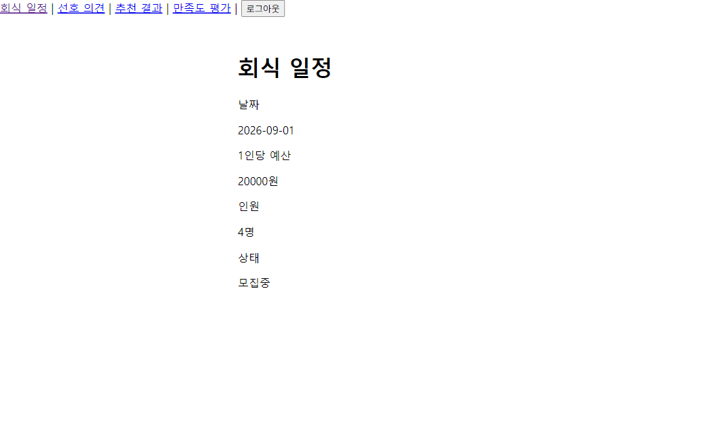

2. **팀원(member01) 로그인 → 선호 의견 제출**
   희망 메뉴 "삼겹살", 못 먹는 음식 "해산물" 제출 성공.
   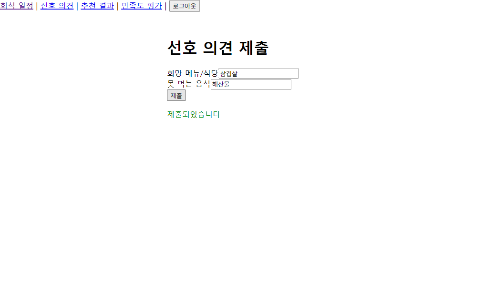

3. **팀장 → 추천 결과 조회**
   예산(20,000원) 이하 식당만 후보로 노출되고, 최근 방문(마라탕공주) 및 저평점(명동찜닭 2.4점, 한신포차 2.1점) 식당은 제외되지 않고 "(낮은 우선순위)" 태그와 함께 하위로 배치됨 — C5 가중치 정상 반영.
   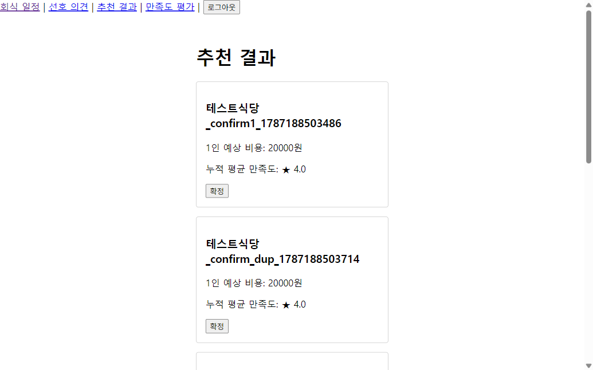

4. **팀장 → "삼겹살천국" 확정**
   확정 성공, 응답 상태 "확정"으로 전환. 성공 메시지에 식당명이 정확히 보간됨.
   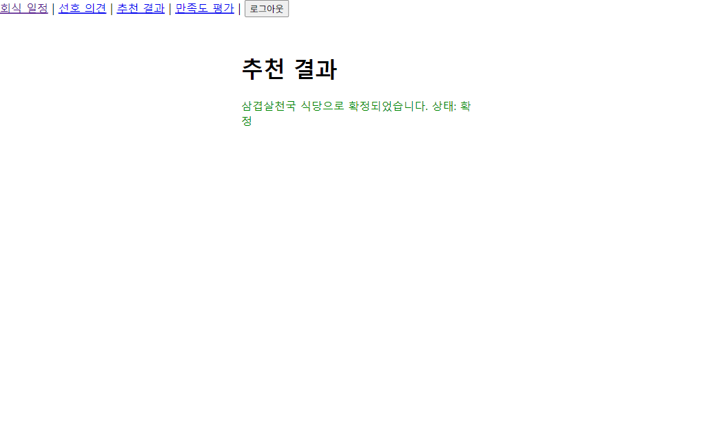

5. **(부가 검증) 팀원 화면에는 확정 버튼 미노출**
   같은 추천 목록을 팀원 계정으로 조회 시 "확정" 버튼 자체가 렌더링되지 않음 (C2 UI 측 방어).
   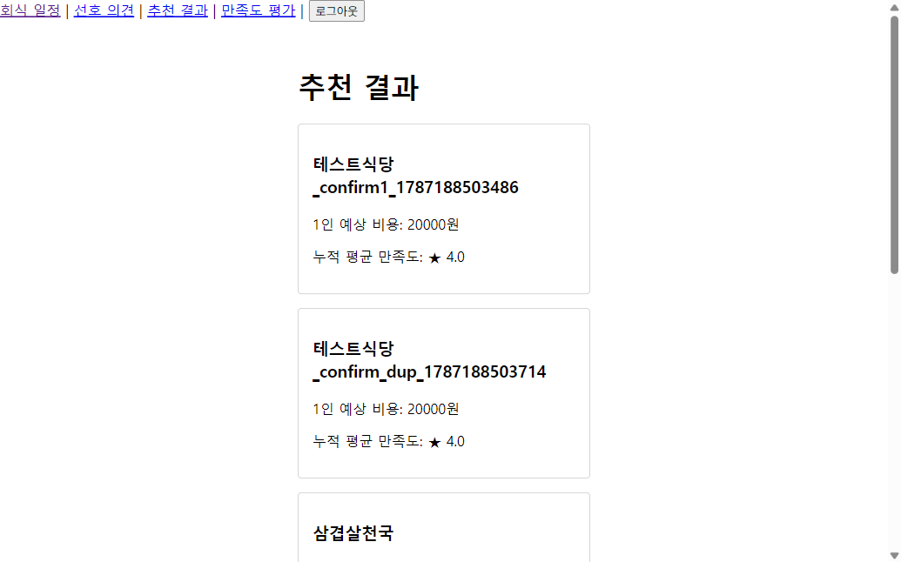

6. **팀장 → 회식 종료 처리**
   상태 "확정" → "종료"로 전환.
   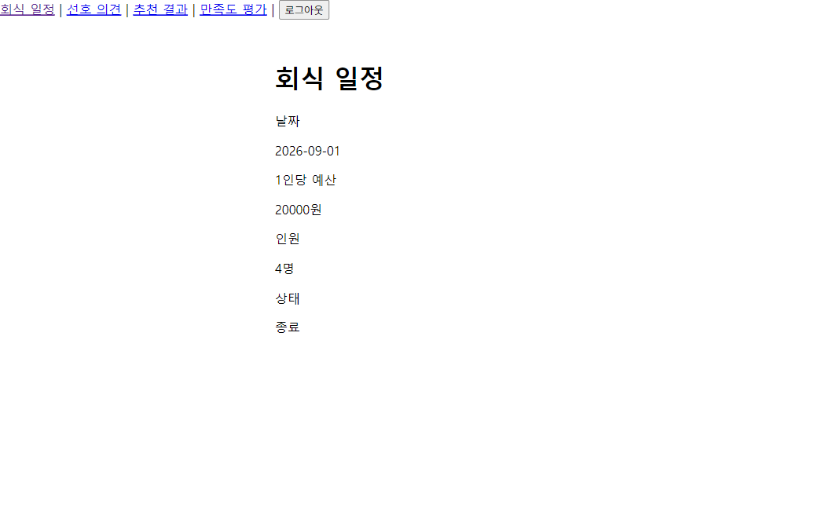

7. **팀원 → 만족도 평가 (5점 + 한줄평)**
   종료 후에는 별점/한줄평 입력이 활성화되며 제출 성공.
   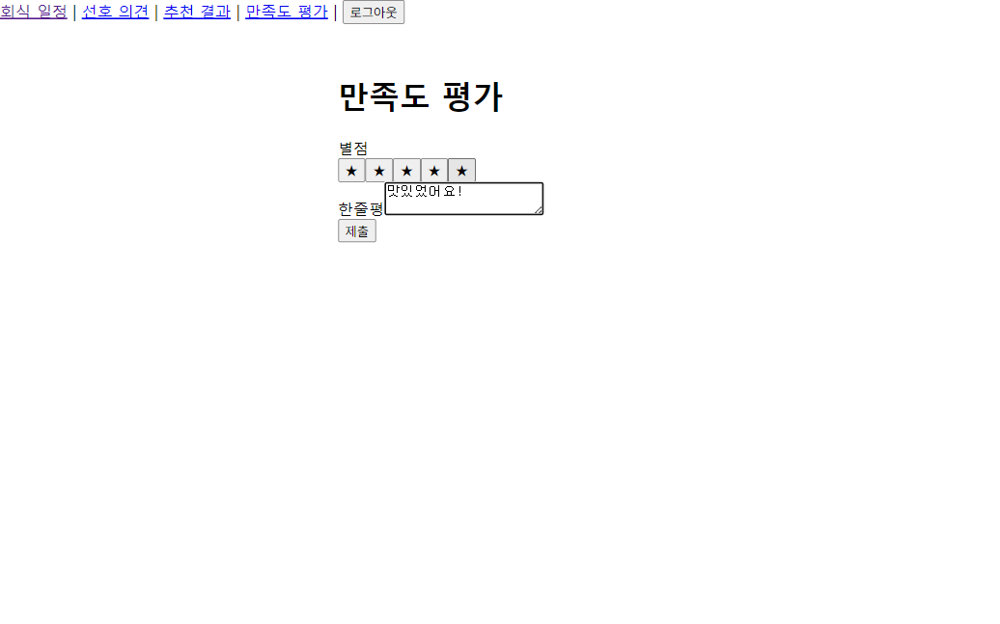
   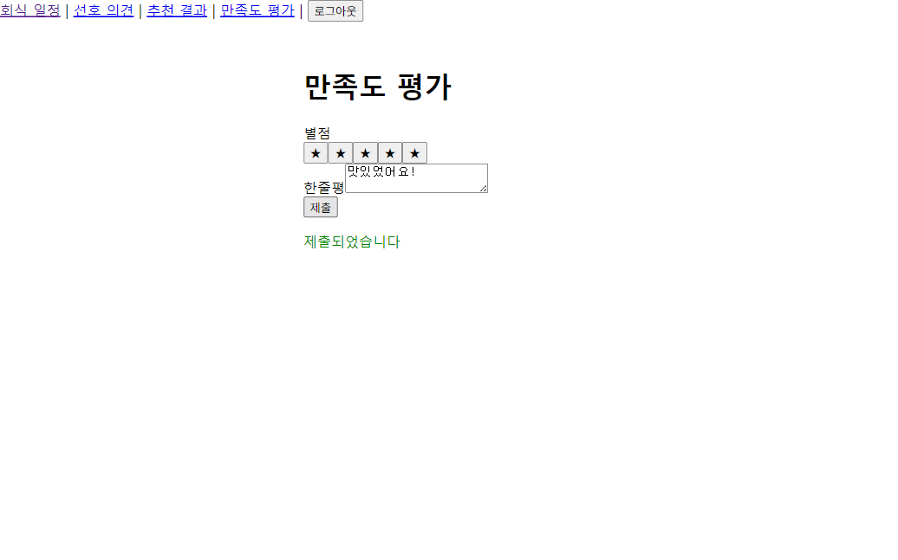

8. **DB 확인**: `restaurants.id=4`(삼겹살천국) `avg_satisfaction_score` = `5.00`, `last_visited_at` = `2026-08-31`(이벤트 날짜 -9시간, UTC 저장)로 갱신됨. 다음 회식 추천 시 이 값이 가중치로 반영되는 구조(6장 피드백 루프)가 데이터 레벨에서 확인됨.

---

## 2. 예외 시나리오 1 — 예산 미입력 상태에서 추천 시도 (C3)

이벤트 id 368 (예산 미입력)로 신규 등록 후 팀장이 추천 결과를 조회.

- 결과: 200이 아닌 400 응답, 화면에 "예산을 먼저 입력하세요" 안내와 "회식 일정에서 예산을 확인하세요" 링크가 노출됨. 문서 4장의 기대 문구와 정확히 일치.
- 콘솔에 `400 Bad Request` 로그가 남지만 이는 예상된 오류 응답이며 실패가 아님(React 개발모드 StrictMode로 요청이 2회 기록됨, 기능상 문제 없음).

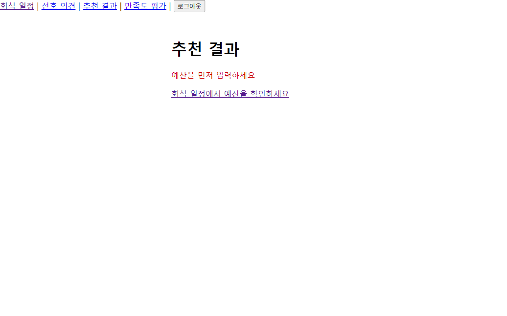

---

## 3. 예외 시나리오 2 — 추천 후보 0건일 때 팀장 수동 확정 (C6)

이벤트 id 369 (예산 1,000원 — 어떤 식당도 충족 못 함)로 등록 후 추천 조회.

- 결과: "조건에 맞는 추천 결과가 없습니다" 메시지와 함께 팀장 전용 "식당 ID로 수동 확정" 입력 폼이 노출됨(정상 200 응답, 에러 아님).
- 식당 ID `4`(삼겹살천국)를 직접 입력해 확정 → "선택한 식당으로 확정되었습니다. 상태: 확정" 성공. DB 조회 결과 `confirmed_restaurant_id=4`, `status='확정'`으로 반영됨.

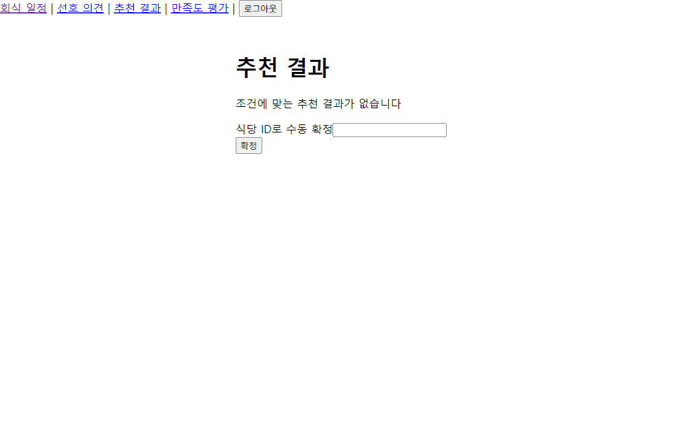
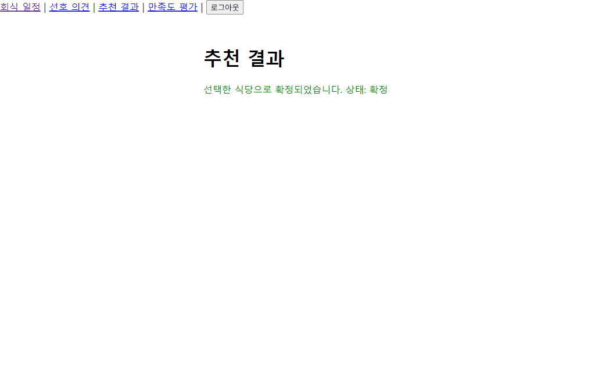

---

## 4. 예외 시나리오 3 — 팀원의 확정 시도 (권한 오류, C2)

- **UI 측**: 팀원(member01) 계정으로 추천 결과 화면을 열면 확정 버튼이 렌더링되지 않음 (위 05번 스크린샷).
- **API 측**: 팀원의 accessToken으로 `POST /api/events/367/confirm`을 직접 호출한 결과:
  ```json
  status: 403
  { "message": "권한이 없습니다" }
  ```
  UI 우회 시에도 백엔드 미들웨어(`requireRole`)가 정상 차단함을 확인.

---

## 5. 예외 시나리오 4 — 회식 종료 전 만족도 평가 시도 (C4)

이벤트 id 367이 "확정" 상태일 때(종료 처리 전) 팀원(member01)이 평가 화면 접근.

- **UI 측**: 별점 버튼 전부 `disabled`, "회식 종료 후 평가 가능" 안내 문구 노출, 제출 버튼도 비활성화됨.
  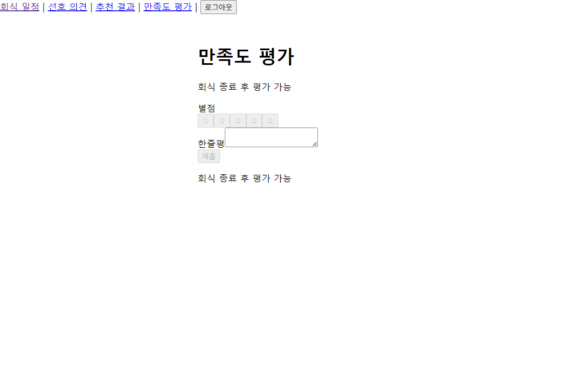
- **API 측**: 동일 시점에 `POST /api/events/367/reviews`를 직접 호출한 결과:
  ```json
  status: 400
  { "message": "회식 종료 후 평가 가능" }
  ```
  UI 우회 시에도 서비스 계층에서 상태 검사로 정상 거부됨을 확인. 이후 팀장이 종료 처리하면(위 happy path 6단계) 즉시 평가가 정상 허용됨.

---

## 6. 피드백 루프 시나리오 — 만족도 저하/최근방문 식당의 우선순위 하향 (C5)

happy path의 추천 결과(3번 스크린샷)에서 별도 시나리오 재현 없이도 다음이 확인됨:

- **한신포차**(평균 2.1점, 2.5점 미만) → "(낮은 우선순위)" 태그, 목록 하단 배치
- **명동찜닭**(평균 2.4점, 2.5점 미만) → 동일하게 하위 배치
- **마라탕공주**(평균 4.0점이지만 최근 방문 이력 존재) → 점수와 무관하게 "(낮은 우선순위)" 하위 배치

세 경우 모두 후보에서 **제외되지 않고** 순위만 최하위로 밀리는 비배제형 로직(C5)이 정상 동작함을 확인. 팀장은 하위로 밀린 식당 대신 상위 후보("삼겹살천국" 등)를 정상적으로 확정할 수 있었음(4단계).

---

## 부가 관찰 (결함 아님)

- 로그인 페이지 최초 로드 시 `favicon.ico` 404 콘솔 에러 — 기능에 영향 없는 사소한 항목.
- C3/C6에서 백엔드가 반환하는 400/200 응답이 브라우저 devtools 콘솔에 `Failed to load resource` 형태로 로깅됨 — 이는 fetch 실패가 아니라 4xx status에 대한 브라우저의 기본 로깅이며, 화면상 정상적으로 처리(에러 메시지/빈 목록 표시)되었음을 스냅샷으로 확인함.
- React StrictMode(dev 모드)로 인해 동일 API 호출이 콘솔에 2회 기록되는 경우가 있으나 실제 동작에는 영향 없음.
